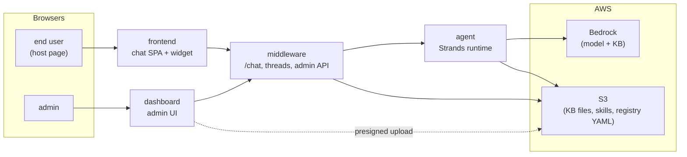

# agentcore-runtime

Monorepo for the **nd8-ai** stack — a Strands-based agent runtime, an HTTP middleware in front of it, an admin dashboard, and an embeddable chat widget.

## Shape



Marketing site (`apps/website` → `nd8.ai`) is standalone — separate domain, separate infra.

## Apps

| App | Port | What it does |
|---|---|---|
| `apps/agent` | `5678` | Strands agent runtime. Loads a registry of agents, exposes `POST /invocations` (SSE). Deploys to AWS Bedrock AgentCore. |
| `apps/middleware` | `7890` | HTTP proxy in front of the agent. Exposes `POST /chat`, threads/state via SQLite, CopilotKit endpoints for the frontend. |
| `apps/dashboard` | `8765` | TanStack Start admin UI — KB, web sources, skills, agent registry editor. |
| `apps/frontend` | `3456` | End-user chat SPA + embeddable widget bundle. |
| `apps/website` | `4321` | Marketing site — `nd8.ai` (Astro, static). Standalone from the runtime: separate domain, separate infra. |

Also: `apps/public-files`, `packages/*` (registry, kit, skills, kb, shared configs), `infra/` (CDK).

## Prerequisites

- Node **24** (`.nvmrc`)
- pnpm **10** (via corepack)
- Docker (only if you want to run the agent as a container)

## Setup

```bash
nvm use                  # picks up node 24
corepack enable          # activates pnpm
pnpm install
```

Then copy env files for each app you plan to run:

```bash
cp apps/agent/.env.example       apps/agent/.env
cp apps/middleware/.env.example  apps/middleware/.env
cp apps/dashboard/.env.example   apps/dashboard/.env
cp apps/frontend/.env.example    apps/frontend/.env
```

## Local run

Open four terminals — order does not matter, but the agent boots the slowest:

```bash
# t1: agent
pnpm --filter agent-runtime dev            # http://localhost:5678

# t2: middleware
pnpm --filter middleware dev               # http://localhost:7890

# t3: dashboard
pnpm --filter dashboard dev                # http://localhost:8765

# t4: frontend (chat SPA)
pnpm --filter frontend dev                 # http://localhost:3456
```

The dashboard's "Try out" button opens the embeddable widget demo — served by a separate static server. Start it when you want to test the widget:

```bash
pnpm --filter frontend preview:widget      # http://localhost:4174/widget-demo.html
```

The marketing site is independent of everything above:

```bash
pnpm --filter website dev                  # http://localhost:4321  (Astro)
```

Smoke test (needs t1 + t2):

```bash
curl -N -X POST http://localhost:7890/chat \
  -H 'Content-Type: application/json' \
  -H 'Accept: text/event-stream' \
  -d '{"prompt":"one-line hello"}'
```

## `.env` — required values only

### `apps/agent/.env`

```env
PORT=5678
AWS_REGION=us-east-1
REGISTRY_SOURCE=s3-yaml
REGISTRY_S3_KEY=registry/agents.yaml
UPLOADS_BUCKET=<your-uploads-bucket>
KB_ID=<your-bedrock-kb-id>

# Memory — use sqlite locally so you don't need AWS AgentCore Memory
MEMORY_PROVIDER=sqlite
```

`MEMORY_PROVIDER=sqlite` writes to `.data/memory.db`. Set `MEMORY_PROVIDER=none` to disable memory entirely.

### `apps/middleware/.env`

```env
PORT=7890
AGENT_MODE=plain
AGENT_PLAIN_URL=http://localhost:5678
RUNNER_TYPE=sqlite
SQLITE_DB_PATH=.data/threads.db
```
`UPLOADS_BUCKET` is only needed if you want the middleware to resolve tenant/agent names against the S3 registry — leave commented for a fully-local run.

### `apps/dashboard/.env`

```env
MIDDLEWARE_URL=http://localhost:7890
WIDGET_DEMO_URL=http://localhost:4174/widget-demo.html
```
(All other keys have sensible defaults or are only needed when wiring KB/skills to real AWS resources.)

### `apps/frontend/.env`

```env
VITE_AGENT_URL=http://localhost:7890/copilotkit
VITE_MIDDLEWARE_URL=http://localhost:7890
```

## Running without AWS access

All three server apps can boot fully offline against the checked-in `apps/agent/agentcore/agents.yaml` — flip each `.env` to `local-yaml`:

```env
# apps/agent/.env
REGISTRY_SOURCE=local-yaml
REGISTRY_LOCAL_YAML_PATH=./agentcore/agents.yaml

# apps/middleware/.env
REGISTRY_SOURCE=local-yaml
REGISTRY_LOCAL_YAML_PATH=../agent/agentcore/agents.yaml

# apps/dashboard/.env
REGISTRY_SOURCE=local-yaml
REGISTRY_LOCAL_YAML_PATH=../agent/agentcore/agents.yaml
```

Paths are resolved against each app's `pnpm dev` working directory. The dashboard's registry-editor writes back to the same file. Admin panels that touch S3/KB (uploads, KB indexing) still need AWS — leave those commented in the `.env` group and the panels stay disabled.

The other backends stay available: `s3-yaml` (reads from `UPLOADS_BUCKET`) and `db-postgres` (needs `REGISTRY_DB_URL`; schema in `packages/registry/src/adapters/database/`).

### Model without Bedrock

Bedrock needs AWS. To drive the agent through an OpenAI-compatible endpoint (any custom router / gateway with an API key), edit `apps/agent/agentcore/agents.yaml`:

```yaml
tenants:
  - id: 231ec442-974b-4933-bc70-b00755fbcfce
    vars:
      OPENAI_KEY:
        type: plain
        value: "sk-..."       # never commit
    agents:
      - id: 14247887-331d-45bc-8e51-96b9582090da
        slug: simple
        version: v1
        enabled: true
        model:
          provider: openai
          openai:
            id: gpt-4o-mini              # your router's model id
            apiKey: "{{ vars.OPENAI_KEY }}"
            baseUrl: https://your-router.example.com/v1
            maxTokens: 4096
            temperature: 0.7
```

Same shape for the `weather` agent. The `baseUrl` override is what lets you point at any OpenAI-compatible endpoint.

## Common commands

```bash
pnpm build                                  # every workspace
pnpm typecheck                              # every workspace
pnpm --filter agent-runtime test            # unit tests (SQLite memory store, etc.)
pnpm --filter agent-runtime docker:build    # linux/arm64 container image
```

## Deploy

CDK is in `infra/`. `pnpm cdk deploy 'Dev/*'` (needs AWS credentials).
